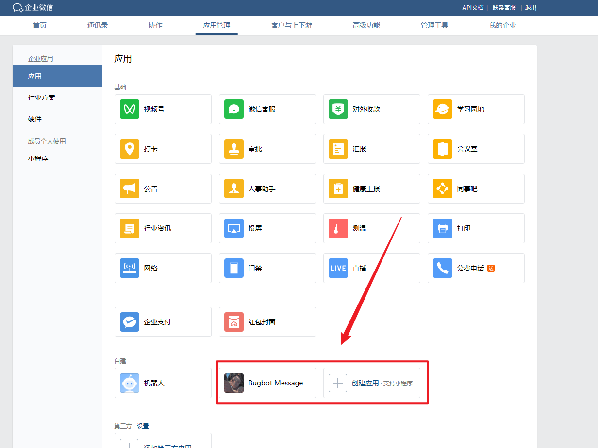
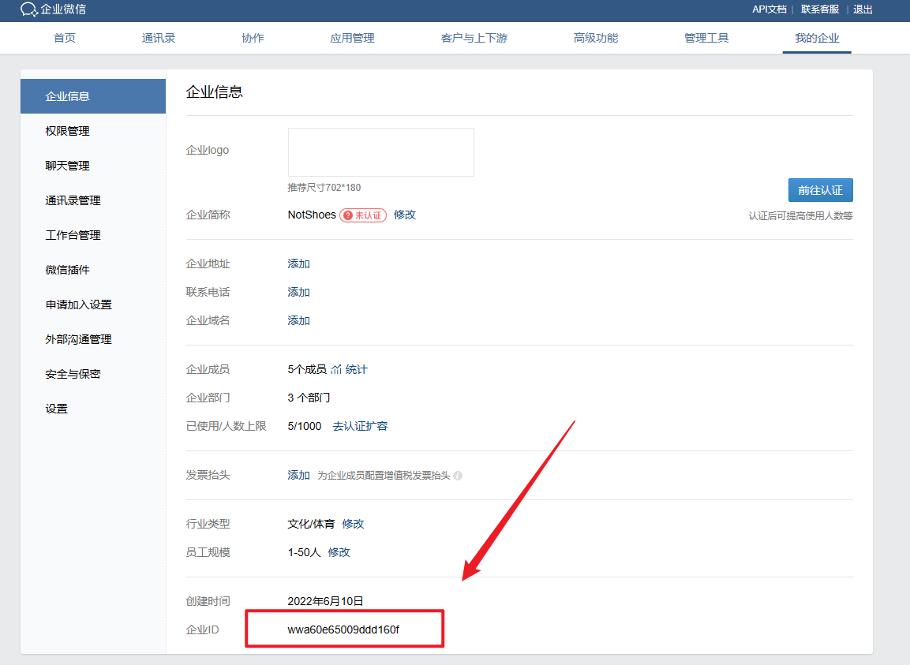
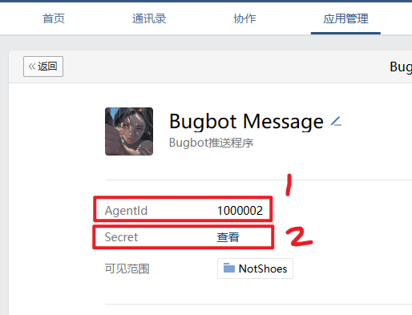
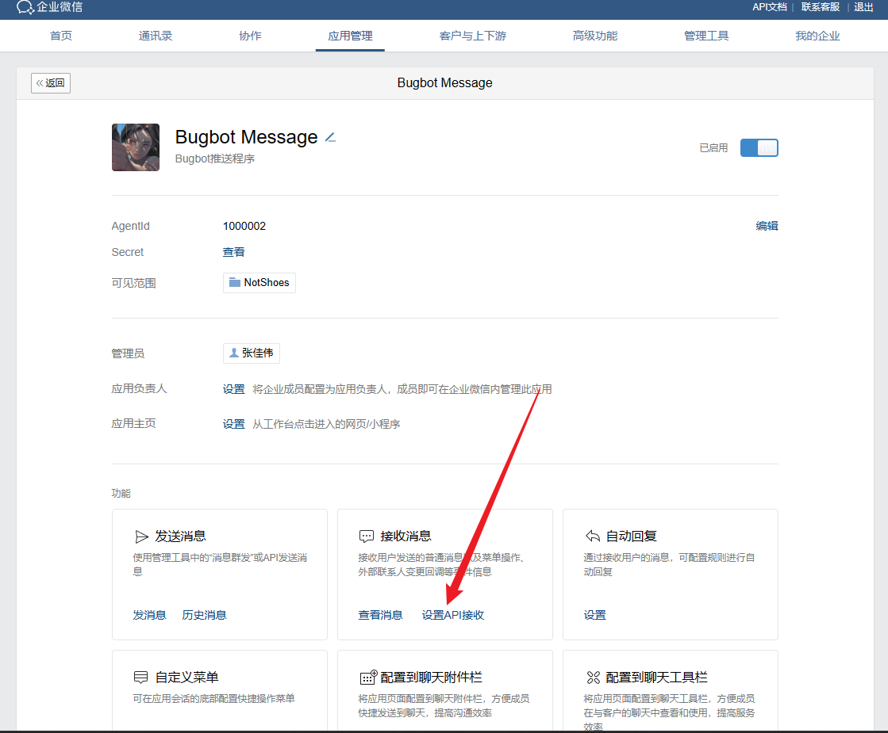
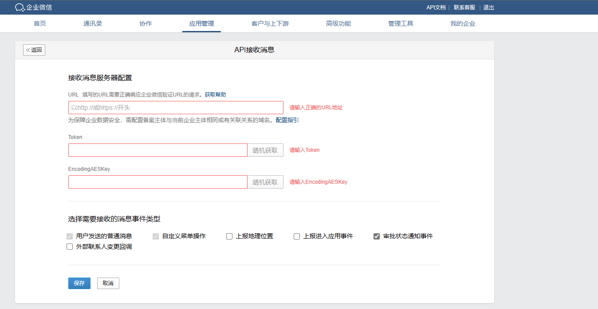
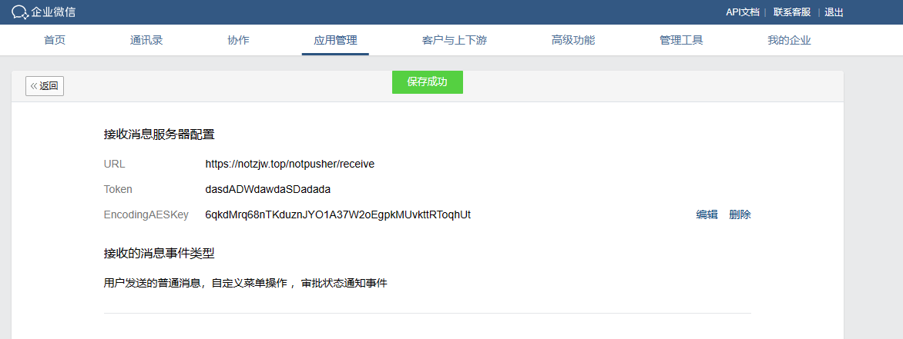
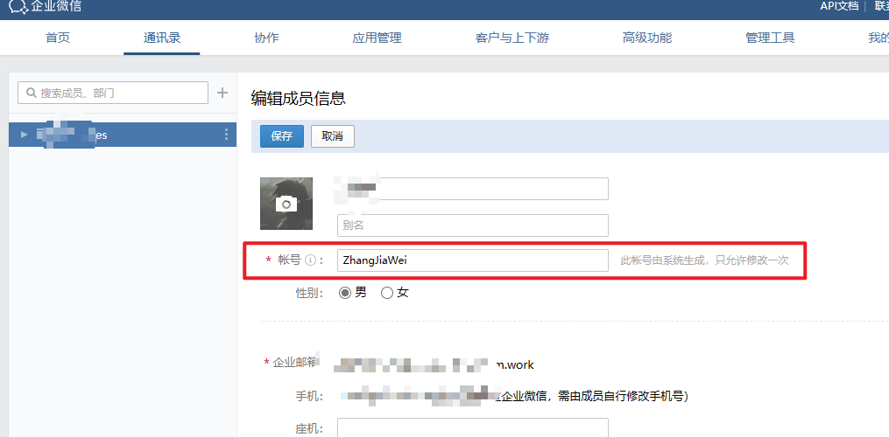
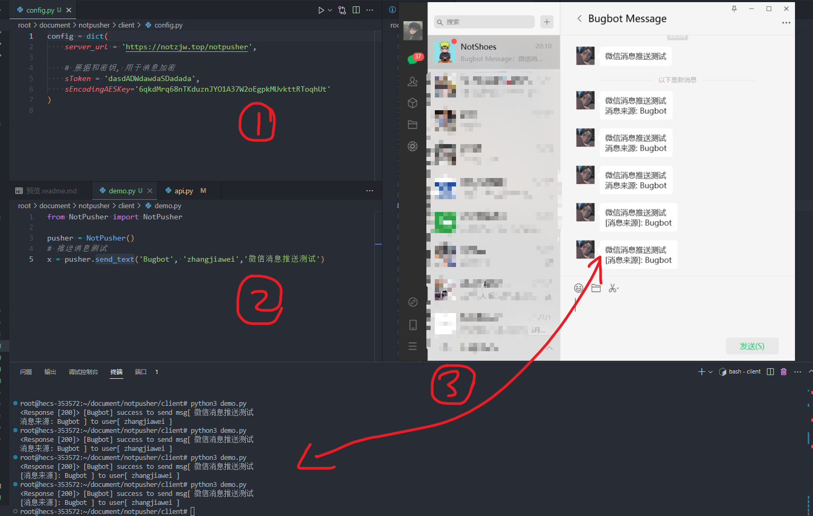

## 服务端部署

1. 拉取代码
    ``` 
    git clone 
    cd notpusher/server
    pip install -r requirement.txt
    
    ``` 

2. 在企业微信里创建自己的企业，并创建一个机器人 https://work.weixin.qq.com/wework_admin/frame


3. 将企业id，应用id，密钥填入config.py的对应地方

 

4. 点击【接收消息】的【设置API接收】


5. 随机生成Token和EncodingAESKey并填入config.py对应位置 


6. 开启flask服务 
    ``` 
    python api.py
    ``` 

6. URL = 你flask服务的地址 + 'receive'，比如我把我的flask服务通过反向代理到https://notzjw.top/notpusher 这个url上，URL = url+'/receive' = https://notzjw.top/notpusher/receive 然后
点击确认就可以了



## 客户端使用

1. 拉取代码
    ``` 
    git clone 
    cd notpusher/client
    pip install -r requirement.txt
    ``` 
2. 让需要接收消息推送的微信号加入你的企业，并获取企业内的userId (红框内)


3. 配置config.py，Token和EncodingAESKey需要和服务端一致 然后**python demo.py**即可
 
